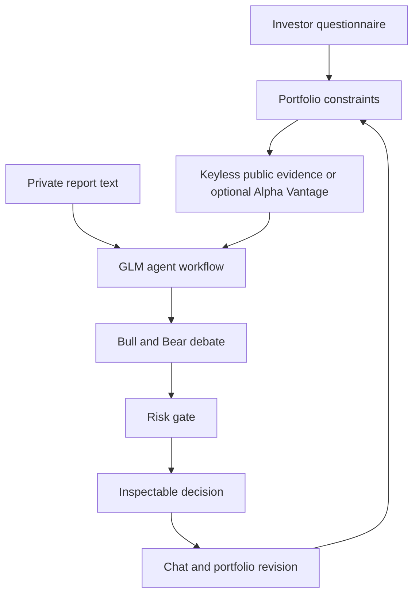

# ClarityInvest

ClarityInvest is an explainable multi-agent investment education and portfolio-analysis prototype. It is inspired by the decision structure in [TauricResearch/TradingAgents](https://github.com/TauricResearch/TradingAgents), while adding an investor questionnaire, benchmark comparisons, linked financial education, evidence traceability, private-report context, and a conversational portfolio-revision loop.

The interface is written in English and is designed for a course project—not live trade execution.

## What the prototype includes

- Seven-step investor questionnaire covering objective, budget, horizon, loss capacity, behavior, learning level, exclusions, and custom instructions.
- Portfolio overview with allocation, S&P 500 comparison, performance, concentration, attribution, and risk/return views.
- Company overview with price context, market capitalization, P/E, ROA, margins, growth, quality scoring, thesis, risks, and catalysts.
- TradingAgents-inspired workflow:
  - Market Analyst
  - Fundamentals Analyst
  - News Analyst
  - Sentiment Analyst
  - Bull/Bear debate
  - Trader proposal
  - Three-perspective risk committee
  - Portfolio Manager decision
- Keyless end-of-day quotes and company data from Nasdaq's public website feed, plus official newsroom items. SEC EDGAR events can be enabled with an identifying server setting.
- Optional Alpha Vantage mode for users who already have a key.
- GLM structured multi-agent synthesis and evidence-connected chat.
- Optional private analyst-report text for a demo evidence source.
- Clickable finance terms that open explanations in the chat rail.
- Interactive portfolio change demo: replacing MSFT with AMZN updates the visible allocation and audit trail.
- Clear separation between live provider data, AI inference, private evidence, and illustrative demo values.

## Privacy and API-key behavior

Market data works without an API key. GLM and Alpha Vantage remain optional:

- Keys are held only in React memory for the current browser tab.
- They are sent to same-origin Next.js server routes only when the user runs an analysis or asks a live question.
- Keys are not written to local storage, a database, logs, source code, or GitHub.
- `.env*` files are ignored by Git.

This is suitable for a classroom prototype. A public production service should add authentication, encrypted secret storage, rate limiting, abuse controls, and a formal privacy policy.

## Run locally

Requirements: Node.js 20.9 or newer.

```bash
npm install
npm run dev
```

Open [http://localhost:3000](http://localhost:3000), complete or skip the questionnaire, and choose **Update data**. The default path needs no key and accepts up to three US stock tickers.

Choose **Data sources** to optionally add:

1. A Zhipu GLM key for agent synthesis and contextual chat.
2. An Alpha Vantage key to replace the keyless market-data fallback.
3. A private analyst-report excerpt for the classroom demo.

The project also supports optional server-side fallback variables:

```bash
cp .env.example .env.local
```

Never commit `.env.local`.

## Deploy online

The project is ready for Vercel because it uses standard Next.js server routes.

[Deploy with Vercel](https://vercel.com/new/clone?repository-url=https%3A%2F%2Fgithub.com%2Fshiwenwang523%2Fclarityinvest-web)

No environment variables are required for keyless market updates. You may configure `GLM_API_KEY`, `GLM_MODEL`, and `GLM_BASE_URL` in Vercel as optional server-side fallbacks. `ALPHA_VANTAGE_API_KEY` is available to direct callers of `/api/market`; the blank-key interface deliberately stays on public mode. Do not place keys in variables prefixed with `NEXT_PUBLIC_`. To add official SEC filing events, set `SEC_USER_AGENT` to a real project name and contact email as required by SEC fair-access guidance.

## Architecture



### Server routes

- `POST /api/public-market` retrieves best-effort end-of-day quotes/company data and official company news feeds without a key. If `SEC_USER_AGENT` is configured, it also retrieves SEC EDGAR events. Each running server instance caches the snapshot for 15 minutes.
- `POST /api/market` uses optional Alpha Vantage credentials for quotes, one primary-company overview, and a combined recent-news feed.
- `POST /api/analyze` calls Zhipu's GLM Chat Completions API for either a structured multi-agent analysis or a contextual chat answer.

## Validation

```bash
npm run lint
npm run build
```

## Important limitation

ClarityInvest provides educational analysis and general investment suggestions. It does not execute trades, guarantee returns, replace a licensed financial professional, or establish a fiduciary relationship. Public-provider data is delayed, best-effort, and can be incomplete. The keyless Nasdaq route uses an undocumented website endpoint, so it is appropriate only as a short-term classroom fallback and may change without notice; use a licensed market-data provider for production. Company-feed timestamps can be publication or update times, while SEC event times use EDGAR acceptance timestamps. Nasdaq P/E and selected ratios are application-derived estimates. The interface retains clearly labeled illustrative sections for demonstration.
