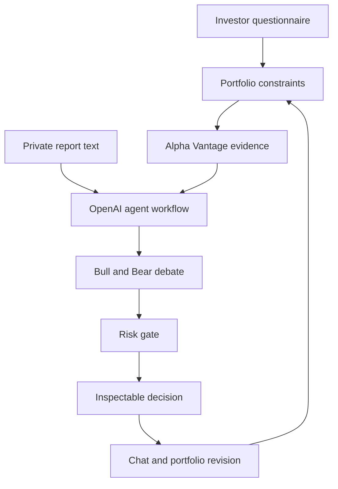

# ClarityInvest

ClarityInvest is an explainable multi-agent investment education and portfolio-analysis prototype. It is inspired by the decision structure in [TauricResearch/TradingAgents](https://github.com/TauricResearch/TradingAgents), while adding an investor questionnaire, benchmark comparisons, linked financial education, evidence traceability, private-report context, and a conversational portfolio-revision loop.

The interface is written in English and is designed for a course project—not live trade execution.

## What the prototype includes

- Seven-step investor questionnaire covering objective, budget, horizon, loss capacity, behavior, learning level, exclusions, and custom instructions.
- Portfolio overview with allocation, S&P 500 comparison, performance, concentration, attribution, and risk/return views.
- Company overview with price context, market capitalization, P/E, ROA, margins, growth, quality scoring, thesis, risks, and catalysts.
- TradingAgents-inspired workflow:
  - Market Analyst
  - Fundamentals Analyst
  - News Analyst
  - Sentiment Analyst
  - Bull/Bear debate
  - Trader proposal
  - Three-perspective risk committee
  - Portfolio Manager decision
- Current quotes, company fundamentals, and recent news from Alpha Vantage.
- OpenAI structured multi-agent synthesis and evidence-connected chat.
- Optional private analyst-report text for a demo evidence source.
- Clickable finance terms that open explanations in the chat rail.
- Interactive portfolio change demo: replacing MSFT with AMZN updates the visible allocation and audit trail.
- Clear separation between live provider data, AI inference, private evidence, and illustrative demo values.

## Privacy and API-key behavior

The UI uses a bring-your-own-key flow:

- Keys are held only in React memory for the current browser tab.
- They are sent to same-origin Next.js server routes only when the user runs an analysis or asks a live question.
- Keys are not written to local storage, a database, logs, source code, or GitHub.
- `.env*` files are ignored by Git.

This is suitable for a classroom prototype. A public production service should add authentication, encrypted secret storage, rate limiting, abuse controls, and a formal privacy policy.

## Run locally

Requirements: Node.js 20.9 or newer.

```bash
npm install
npm run dev
```

Open [http://localhost:3000](http://localhost:3000), complete or skip the questionnaire, choose **API setup**, and enter:

1. An OpenAI API key.
2. An Alpha Vantage API key.
3. Up to three US stock tickers.
4. Optionally, a private analyst-report excerpt.

The project also supports optional server-side fallback variables:

```bash
cp .env.example .env.local
```

Never commit `.env.local`.

## Deploy online

The project is ready for Vercel because it uses standard Next.js server routes.

[Deploy with Vercel](https://vercel.com/new/clone?repository-url=https%3A%2F%2Fgithub.com%2Fshiwenwang523%2Fclarityinvest-web)

No environment variables are required for the session-only BYOK flow. You may configure `OPENAI_API_KEY` and `ALPHA_VANTAGE_API_KEY` in Vercel as optional server-side fallbacks, but do not place keys in variables prefixed with `NEXT_PUBLIC_`.

## Architecture



### Server routes

- `POST /api/market` validates tickers and retrieves three quotes, one primary-company overview, and a combined recent-news feed.
- `POST /api/analyze` calls the OpenAI Responses API for either a structured multi-agent analysis or a contextual chat answer.

## Validation

```bash
npm run lint
npm run build
```

## Important limitation

ClarityInvest provides educational analysis and general investment suggestions. It does not execute trades, guarantee returns, replace a licensed financial professional, or establish a fiduciary relationship. Live provider data can be delayed or incomplete, and the interface retains clearly labeled illustrative sections for demonstration.
